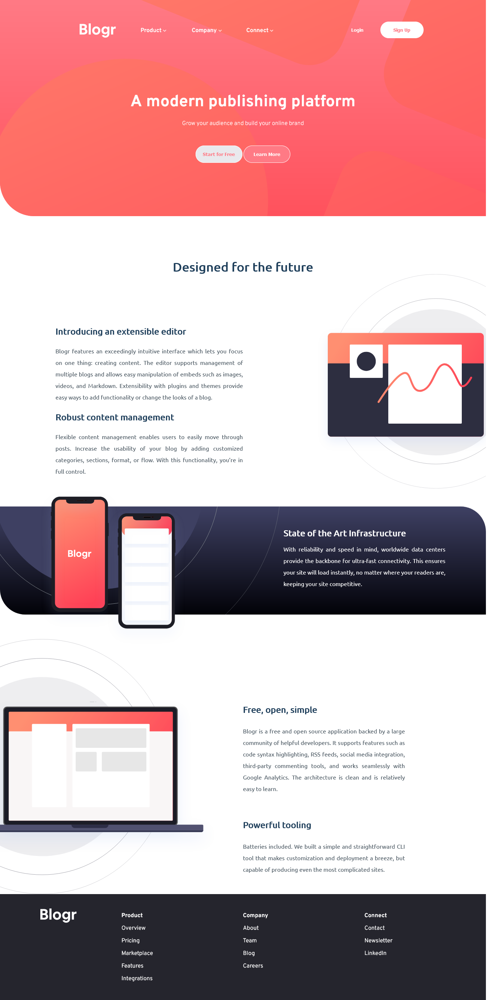

# Frontend Mentor - Blogr landing page

## Table of contents

- [Overview](#overview)
  - [The challenge](#the-challenge)
  - [Screenshot](#screenshot)
  - [Links](#links)
- [My process](#my-process)
  - [Built with](#built-with)
  - [Useful resources](#useful-resources)
- [Author](#author)

## Overview

### The challenge

Users should be able to:

- View the optimal layout for the app depending on their device's screen size
- See hover states for all interactive elements on the page

### Screenshot

### Links

- Solution URL: [Github](https://github.com/3okasha/blogr-landing-page)
- Live Site URL: [Github Pages](https://3okasha.github.io/blogr-landing-page/)

## My process

### Built with

- Semantic HTML5 markup
- CSS Grid
- Vanilla JS

### Useful resources

- [W3Schools Tutorial](https://www.w3schools.com/)
- [TheNetNinja Channel]()
- [Maharatech JS Frontend Track](https://maharatech.gov.eg/course/index.php?categoryid=13/)

## Author

- Frontend Mentor - [@Mohamed Okasha](https://www.frontendmentor.io/profile/3okasha)